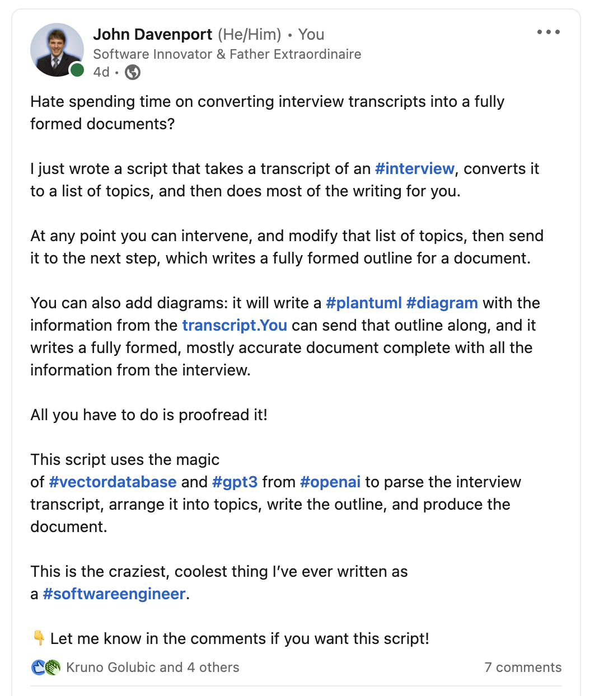
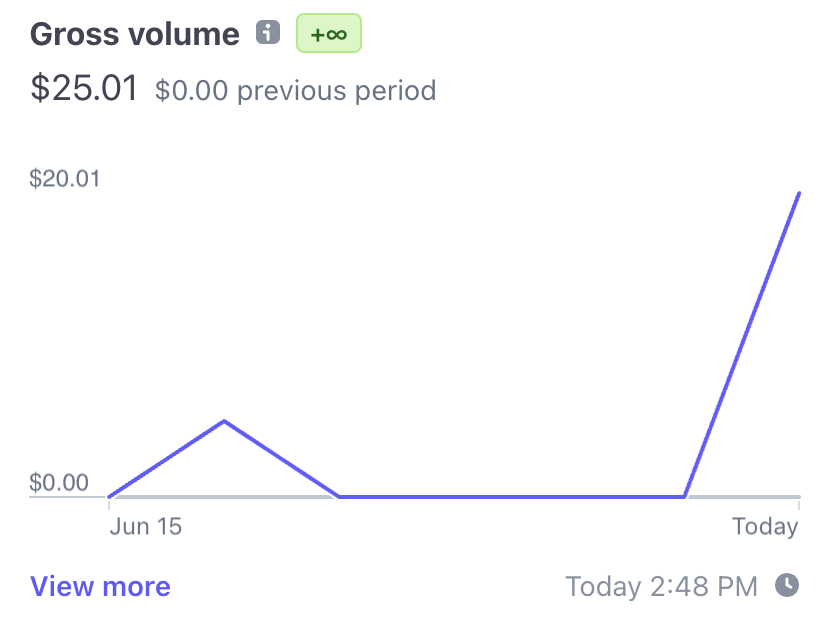
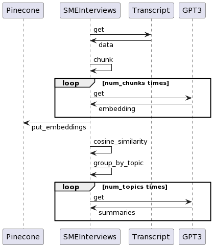
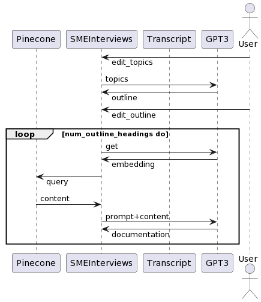

# **Conversation Intelligence With Elixir and OpenAI**

It's not the talk you were promised

---

## This Talk

* Story time
* Discussit V1
* NLP & AI in Elixir

---

## John Davenport

* 2 applications in production
* 3 applications in staging
* 1 engineering contract (complete)
* Gainfully employed
  
---

## The Plan

* Do the procedural things in Discussit
* Learn the basics on a crappy live book script
* Give a talk about the crappy live book script to ISTC
* Apply the basics to Discussit
* Present it today

---

## What Happened

* Do the procedural things in Discussit
* Learn the basics on a crappy script
* Give a talk about the crappy script to ISTC
* Post about it on Linkedin

---

### Customer

So how would I leverage your solutions for parsing out interviews into text or reports?
What would the deploy/ onboarding process look like?

### John Davenport

Ah
I'll get you the repo and help you deploy it, and write a document on how to use it.
Want to give it a go? I'll sell you access for $5.

---

### Customer

Can I meet with you later today to get a run down? I can pay you the 5 no problem

### John Davenport

YAY
It will be easy (this is what we call foreshadowing)

---

## He Closed

He bought the wrong stuff

* Shipped 4 products
* First sale from a Linkedin post
* First implementation was a total bust
* Second implementation landed in the temple of OOM
  
---

# Discussit V1

---

## Data Preparation

* Reads transcript
* Creates embeddings
* Builds cosine similarity matrix between embeddings
* Groups embeddings by similarity
* Creates summaries of groups
* You can do this for subtopics too
  
---

## Writing

* Gets an embedding for each outline topic
* Queries that embedding from pgvector
* Sends context and outline topic to GPT-3
* GPT-3 generates a draft
  
---

# Demo

---

## Generally

This is not procedural programming, it's a whole other ballgame

* Consistent input, consistent process, inconsistent output
* Huge compute and memory loads
* Get your mocks and your VCR
* Get ready to send the work off your application server
* Get the final output before you start fiddling, because there's a lot of knobs to twiddle

---

## JTBD

There's a lot to do and learn

* Handling vectors and embeddings
* Text chunking 
* Language interoperability 
* Prompt engineering
* Learn the OpenAI API's

---

## I wish I'd known

* [GPT3 Tokenizer](https://hexdocs.pm/gpt3_tokenizer/api-reference.html) for tokenization and token counts without polluting your project with NIF's or computationally intensive inference
* [pgvector](https://github.com/pgvector/pgvector) because there can only be one
* [pysdb](https://pypi.org/project/pysdb/) because finding sentences is hard
* [exvcr](https://hex.pm/packages/exvcr) because OpenAI calls take forever
* [erlport](https://hex.pm/packages/erlport) for calling python
* [similarity](https://hexdocs.pm/similarity/Similarity.html) for Cosine Similarity

---

# Deployent

This slide is for Mattia. He will ask anyways.

* Deployed on fly.io
* Used a custom database image to include the pgvector extension
* Modified dockerfile to install python and libraries
* Deployed topic analysis to a lambda with long timeouts
--- 

# Questions