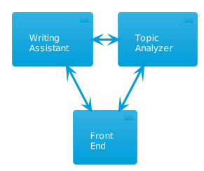

---

theme: gaia
_class: lead
paginate: true
backgroundColor: #fff
backgroundImage: url('https://marp.app/assets/hero-background.svg')
marp: true

---

# **Discussit**
Kickoff

---

# **Courseware Development for OpenRoom**

We will be the source of conversation data for Artificial Intelligence and Machine Learning.

---

# MVP

* Takes a transcript
* Analyzes the topics in the transcripts
* Writes an informed document based on the conversation data

---

# Customers we have now
* [Kruno Golubic](https://www.linkedin.com/in/kgolubic/) - Developer relations at MemGraph (Marketing)
Plans to use Discussit to conduct product-management style interviews.
Gross Revenue: $20
* [Joaquin Melara](https://www.linkedin.com/in/joaquin-melara/)
Plans to use Discussit to analyze conversations with consulting customers (validate).
Gross Revenue: $5
0 technical writers

---

# Roles
None of this is final, just a first cut:
* Ryan Lund - Sales + Product Management
* Emily Merritt - Marketing + Operations
* John Davenport - Engineering + Product + Operations + Infrastructure
  
---

# Goals
* Sales - Close 3 customers with MVP (our flat rate cohort)
* Engineering - Stabilize MVP, resume development of V1
* Marketing - Stand up basic stuff (website, linkedin, logo)
* Corporate - draft agreement